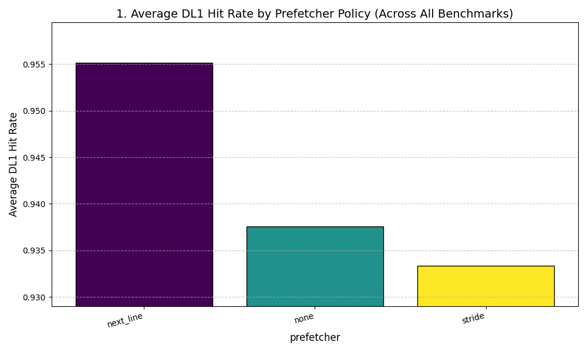
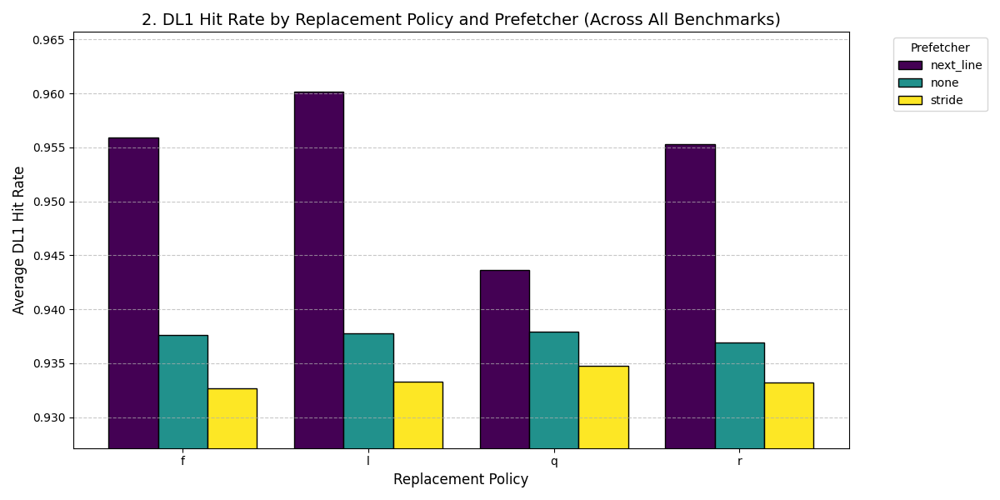
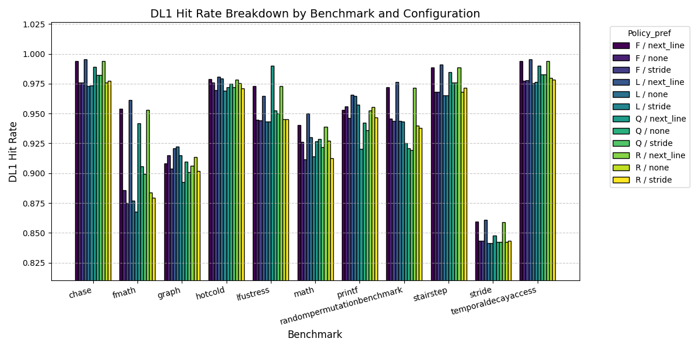
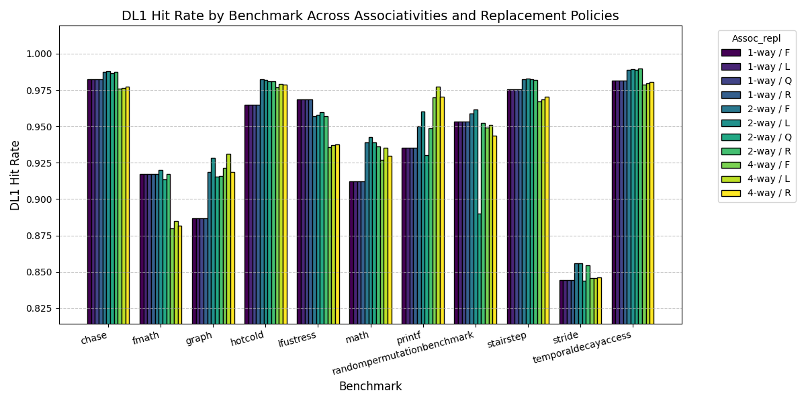

# Advanced Computer Architecture Project

**Authors:**  
Aditya Dhananjay Singh (22cs02001),
Kumar Snehal (22cs02009),
Atharva Atul Penkar (22cs02011)

**Report:**  
Refer to the detailed project report [ACA_Lab_Project_Report.pdf](./ACA_Lab_Project_Report.pdf)

---

## Project Overview

This project enhances the SimpleScalar cache simulator by implementing:

- A **Least Frequently Used (LFU)** cache replacement policy.
- Multiple **prefetcher policies**: *None*, *Next-Line*, and *Stride Prefetching.*

These extensions allow robust evaluation of cache behavior under diverse replacement and prefetch strategies.

---

## Changes Made and Locations

### 1. LFU Cache Policy
- **Location:** `cache.c`, `cache.h`  
- **Details:**  
  - Each cache block gains a `freq_count` tracking number of accesses.  
  - LFU evicts the block with the lowest frequency on replacement.  
  - Block frequency increments on every hit or access.  
  - Replacement logic updated to scan and select minimum frequency block during eviction.

### 2. Prefetcher Support and Integration
- **Location:** `cache.c`, `cache.h`, simulator config  
- **Details:**  
  - Cache struct extended with `enum prefetcher_policy prefetcher` and stride table allocation for stride prefetcher.  
  - `cache_create()` initializes stride prefetcher structures when enabled.  
  - Command-line option (`-prefetcher`) added for runtime prefetcher selection.  
  - Prefetchers invoked on cache misses and slow hits within `cache_access()`.

---

## How the Prefetchers Work

### Next-Line Prefetcher
- **When:** On cache misses and slow hits. No prefetch on repeated fast hits.  
- **Logic:** Always prefetch the immediately next consecutive cache block after the current one.  
- **Use Case:** Sequential memory scans like array traversals.  
- **Limitation:** Prefetches may waste bandwidth if access pattern is irregular.

### Stride Prefetcher
- **When:** On misses and slow hits, but only prefetches after learning a stable stride.  
- **Logic:**  
  - Maintains a stride table indexed by XOR-folded block addresses to reduce collisions:
    ```
    index = ((block_addr / block_size) ^ ((block_addr / block_size) >> 4)) % stride_table_size;
    ```
  - Tracks last accessed block, stride, and confidence per table entry.  
  - If current stride matches stored stride, increases confidence (max 3).  
  - On stride change, resets confidence to 1 for quick relearning.  
  - Once confidence ≥ 1, predicts next block address as current + stride and issues prefetch.  
- **Use Case:** Regular but non-sequential patterns like strided matrix or scientific data access.  
- **Benefit:** Adapts and prefetches more effectively in patterned, non-consecutive accesses.

---

## Prefetch Request Handling
- Prefetches are non-blocking, issued asynchronously to overlap with normal execution.  
- Cache misses and evictions proceed normally, keeping prefetch transparent to CPU pipeline.  
- Prefetcher avoids dependence on program counter by hashing block addresses with XOR folding for indexing.

---

## Why These Enhancements Matter

- **LFU** protects frequently used blocks better than recency-based policies, beneficial in workloads with hotspots.  
- **Next-Line** exploits strong spatial locality in sequential workloads simply and efficiently.  
- **Stride** intelligently prefetches non-sequential but regular accesses, improving cache performance in more complex applications.  
- **XOR folding** reduces stride table collisions without adding PC tracking complexity.  
- **Confidence mechanism** avoids premature or incorrect prefetches, increasing accuracy and reducing useless memory traffic.

---

## Practical Summary

| Feature           | Description                                     | Ideal Use Case               | Limitation                    |
|-------------------|------------------------------------------------|-----------------------------|-------------------------------|
| LFU Replacement   | Evicts blocks used least frequently             | Hotspot-heavy workloads      | Requires tracking frequency     |
| Next-Line Prefetch| Prefetches next consecutive block               | Sequential memory scans      | Inefficient for irregular access|
| Stride Prefetch   | Learns stride pattern, prefetches accordingly   | Strided/patterned memory ops | Needs stable repetitive strides  |

---

## Usage

- Set replacement: `:q` for LFU instead of `:l/r/f` in cache configuration file.  
- Set prefetcher: `-prefetcher=none`, `-prefetcher=next_line`, or `-prefetcher=stride`.  
- Execute benchmarks and analyze cache hit rates to assess impact.

---

## How to Run

- The following scripts exist to automate and ease the running of simulations:
  - `run_benchmarks.sh`: runs all the benchmarks in `/benchmarks` with all the cache configurations `/cache_configs` with all the prefetchers options and stores the results in `/results`.
  - `extract_data.sh`: goes over all the result files and stores the level 1 cache hit rates along with cache configurations and prefetcher options in `benchmarks_data.csv`.
  - `plotdata.py`: reads the `benchmarks_data.csv` and plots the dl1 data and stores plots in root.

You may run all in sequence using `runAll.sh`:
```
chmod +x runAll.sh
./runAll.sh
```
---

# Cache Benchmark Suite

This document summarizes the eight primary cache workloads used for testing replacement policies, prefetcher effectiveness, and geometry sensitivity.

---

## 1. Multi-Stream Chase Benchmark (Prefetcher Stress Test)

This benchmark forces a severe conflict across independent, linear streams to test prefetchers under heavy capacity pressure.

**Purpose:** To generate predictable memory accesses that are forced out of the cache quickly.

| Component | Mechanism | Stress Test Focus |
| :--- | :--- | :--- |
| **Data Footprint** | Massive (512 KB+) | Ensures data **exceeds cache capacity**, guaranteeing continuous eviction. |
| **Outer Loop (8 Streams)** | Jumps between 8 independent memory regions. | Creates severe **Capacity Conflict** by flushing blocks needed just moments ago. |
| **Inner Loop (Sequential)** | Linear access within each stream. | Provides **perfect spatial locality** (fixed stride) for $\text{Next-Line}$ and $\text{Stride}$ prefetchers to successfully predict and hide latency. |

The expected result is a clear performance hierarchy where $\text{Next-Line}$ and $\text{Stride}$ policies significantly outperform the $\text{None}$ policy.

---

## 2. Depth-First Search (DFS) Pointer Chase Benchmark

This benchmark is designed to create cache instability by simulating highly scattered data accesses in memory.

**Purpose:** To generate accesses that are mathematically **unpredictable** due to heap fragmentation.

| Component | Mechanism | Cache Access Pattern |
| :--- | :--- | :--- |
| **Heap Fragmentation** | Uses dummy allocations to scatter Node structs across memory. | Intentionally destroys **Spatial Locality**. |
| **Traversal Workload** | Executes a recursive DFS following arbitrary pointers. | The memory access sequence is **unpredictable**. |

**Expected Outcome:** Prefetchers should show **zero benefit** over the $\text{None}$ policy.

---

## 3. Graph Traversal (BFS) Benchmark

This benchmark simulates searching a large, dense graph using a Breadth-First Search (BFS) algorithm.

**Purpose:** To stress the cache with alternating access patterns: highly sequential (queue) and highly random (graph node access).

| Component | Mechanism | Cache Access Pattern |
| :--- | :--- | :--- |
| **Node Access (`curr->neighbors[i]`)** | **Pointer Chasing** | Memory addresses of neighboring nodes are widely scattered, generating unpredictable **Compulsory/Capacity Misses**. |
| **Queue Operations** | **High Sequential Access** | The queue provides high locality for control data, contrasting with the graph data access. |

**Expected Outcome:** LRU/LFU policies should perform better than FIFO/Random due to better management of active neighbor blocks.

---

## 4. Hot/Cold Region Access Benchmark

This synthetic workload is designed to demonstrate LFU's superiority by explicitly punishing time-based policies (like LRU).

**Purpose:** To access a small, useful "hot" region much more frequently than a large "cold" region used purely for flushing the cache.

| Component | Mechanism | Stress Test Focus |
| :--- | :--- | :--- |
| **Hot Region (80% of Accesses)** | Small region accessed constantly. | Blocks are always high-frequency, but can become 'Least Recently Used' very quickly. |
| **Cold Region (20% of Accesses)** | Large region accessed randomly within itself. | Sweeps out Hot Blocks, forcing LRU to evict useful data. |

**Expected Outcome:** LFU should show **significantly higher hit rates** than LRU, FIFO, and Random.

---

## 5. Random Permutation Benchmark

This benchmark simulates a highly fragmented, unpredictable access pattern that minimizes locality across the data set.

**Purpose:** To establish a baseline worst-case scenario for hit rates and measure the intrinsic overhead of each replacement policy.

| Component | Mechanism | Cache Access Pattern |
| :--- | :--- | :--- |
| **Access Indices Array** | **Pre-shuffled Pointers** | The data access order is arbitrary and unpredictable across the entire memory range. |
| **Overall Stress** | **Randomness Dominates** | Destroys both temporal and spatial locality; differences between predictive and non-predictive policies should be minimal. |

**Expected Outcome:** Hit rates for all policies should be low and clustered closely together.

---

## 6. Stair-Step Benchmark

This benchmark simulates an optimized memory access pattern typical in dense matrix operations and image processing.

**Purpose:** To create bursts of intense temporal locality followed by severe capacity conflicts.

| Component | Mechanism | Cache Access Pattern |
| :--- | :--- | :--- |
| **Matrix Tiling** | Accesses small, contiguous blocks ($16 \times 16$) before jumping to the next block. | High spatial locality within the tile; abrupt capacity miss when jumping to the next tile. |
| **Overall Stress** | **Recency Test** | Predictable access allows LRU to perform exceptionally well, provided the tile size fits the cache. |

**Expected Outcome:** LRU/LFU should significantly outperform FIFO/Random.

---

## 7. Fixed Stride Benchmark

This simple linear benchmark verifies that the prefetcher is functional and accurate at a specific, large stride.

**Purpose:** To test the reliability and latency-hiding ability of the Stride Prefetcher.

| Component | Mechanism | Cache Access Pattern |
| :--- | :--- | :--- |
| **Array Access** | Accesses a large array with a fixed, non-unit stride (e.g., $+256$ bytes). | Perfect mathematical predictability. |
| **Overall Stress** | **Stride Predictor Test** | Forces a miss on every access, but the address of the next miss is always known. |

**Expected Outcome:** $\text{Stride}$ prefetcher must perform significantly better than $\text{Next-Line}$ (which will fail due to the large stride) and $\text{None}$.

---

## 8. Temporal Decay Access Benchmark

This benchmark simulates a shifting working set where old, frequently used data becomes obsolete quickly.

**Purpose:** To measure how efficiently replacement policies discard old, high-utility data in favor of new data.

| Component | Mechanism | Cache Access Pattern |
| :--- | :--- | :--- |
| **Phased Access** | Access is concentrated in a "working set" region for a set period, then the working set permanently shifts to an adjacent region. | Creates blocks with high but obsolete frequency counts. |
| **Overall Stress** | **Working Set Adaptation** | Challenges LFU to quickly evict blocks with historically high counts. LRU typically performs well here. |

**Expected Outcome:** LRU should perform well, while a naïve LFU implementation may struggle due to its reliance on outdated historical frequency data.

---
# Experimental Results and Analysis

This section visualizes the impact of different cache replacement and prefetcher policies across our suite of benchmarks. Each figure and explanation highlights crucial insights into spatial/temporal locality, cache architecture, and the real-world effectiveness of LFU, LRU, FIFO, Random, Next-Line, and Stride prefetching.

---

## 1. **Average DL1 Hit Rate by Prefetcher Policy**



**Insight:**  
- The **Next-Line Prefetcher** delivers the highest average DL1 hit rate, as it effectively exploits the strong spatial locality present in array-based benchmarks.
- **No prefetching** (none) performs moderately, capturing hits that arise from purely temporal patterns.
- The **Stride Prefetcher** performs worst in our suite, as our chosen benchmarks lack the large regular strides necessary for it to outperform next-line prefetching.

---

## 2. **DL1 Hit Rate by Replacement Policy and Prefetcher**



**Policy Descriptions & Observations:**  
- **LRU (Least Recently Used)**: Excels by evicting the block that has been unused for the longest period. Leverages temporal locality and consistently yields the highest hit rates.
- **LFU (Least Frequently Used)**: Protects frequently-used blocks over time, but can falter if blocks used non-repetitively and critically are evicted due to lower long-term count.
- **FIFO (First-In, First-Out)**: Evicts blocks based purely on insertion order, disregarding usage, often resulting in poor performance in cyclical or temporal-locality-heavy workloads.
- **Random**: Baseline; blocks are evicted arbitrarily, leading to erratic and generally poor performance.

---

## 3. **DL1 Hit Rate Breakdown by Benchmark**



**Explanation:**  
- All results here focus on **Data Cache (DL1)**, as instruction cache effects are naturally more uniform due to code colocation.
- Each bar group compares all replacement and prefetcher configurations across our synthetic and real benchmarks.
- This comprehensive breakdown is the backbone for detailed, per-benchmark analysis in the report.

---

## 4. **DL1 Hit Rate Across Associativities and Replacement Policies**



**Interpretation:**  
- **1-way (Direct-Mapped):** Consistently lowest performance due to high conflict misses, as blocks frequently “fight” for the same cache slot.
- **2-way / 4-way Set Associative:** Dramatic reduction in conflict misses; 2-way yields the biggest improvement, and 4-way approaches optimal capacity miss-only behavior.
- The trend confirms classic cache design wisdom: modest increases in associativity can greatly enhance hit rates before returns diminish.

---

**Summary:**  
These visualizations reinforce that the choice of replacement policy, prefetching logic, and cache associative structure is deeply workload-dependent. Next-line prefetching and high associativity suit spatially constrained, sequential workloads, while sophisticated policies like LFU and strided prefetching reveal their strengths only under targeted benchmarks with compatible access patterns.

For further interpretation, methodology, and code details, consult [ACA_Lab_Project_Report.pdf](./ACA_Lab_Project_Report.pdf).
